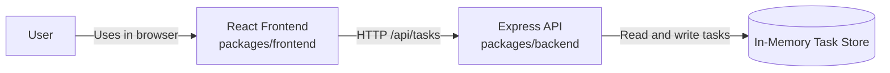

# Cloud Architecture Overview

## Summary

This monorepo contains a simple full-stack TODO application with a React frontend and an Express API. The frontend runs in the browser, sends HTTP requests to the backend, and renders the task management experience. The backend handles task API requests and stores task data in an in-memory database for the current runtime session.

## System Context

## Component Roles

- The React frontend provides the task UI and calls the backend API.
- The Express API exposes task endpoints for create, read, update, and delete operations.
- The in-memory store keeps task data only while the backend process is running.

## Notes

- The architecture is intentionally simple for bootcamp use.
- The current backend store is ephemeral and does not persist across restarts.
- Frontend and backend are developed together in the same npm workspace monorepo.